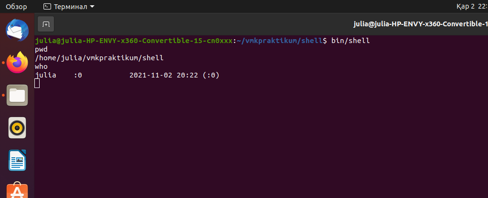
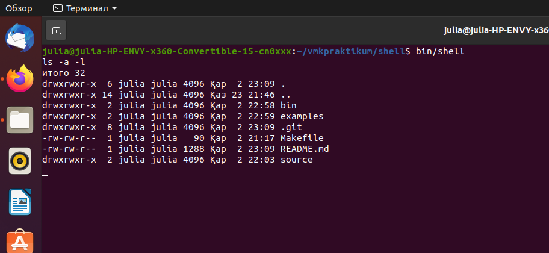
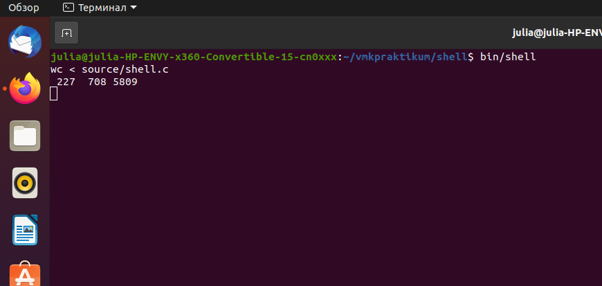

# shell
Эмулятор терминала Linux
## Установка
Linux:

1. Скопируйте репозиторий на ваше устройство:

```sh
git clone git@github.com:exile8/shell.git
```
2. Выполните сборку программы (убедитесь, что вы находитесь в каталоге **shell**):

```sh
cd shell
make
```
## Примеры использования

* Выполнение команд linux без аргументов



* Выполнение команд linux c аргументами



* Перенаправление ввода



* Перенаправление вывода

* Одновременное перенаправление ввода и вывода

* Конвейер

* Конвейер с перенаправлением ввода и вывода в файлы

* Выход из программы

## История версий
* 1.0
    * Деление ввода на лексемы
* 2.0
    * Стандартный запуск программы
* 3.0
    * Перенаправление ввода и вывода
* 4.0
    * Конвейер из двух программ
* 5.0
    * Конвейер из n программ
